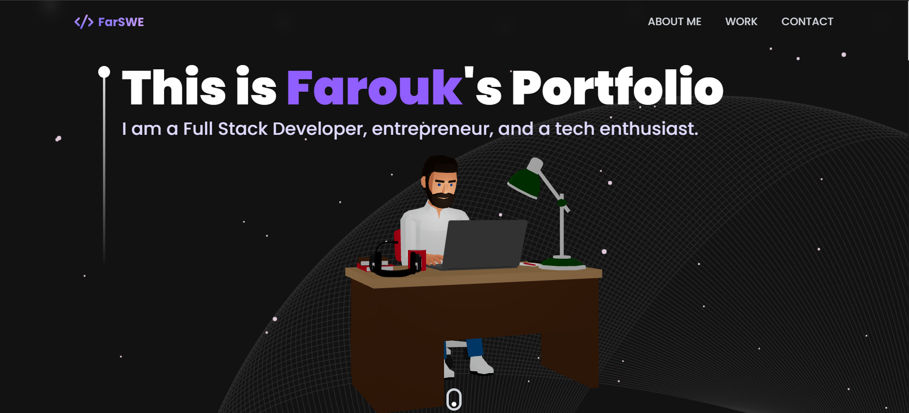

# Farouk's Portfolio



This portfolio showcases Farouk's skills as a Full Stack Developer, featuring interactive 3D models, animations, and a responsive design. It is built using React, Three.js (via `@react-three/fiber`), and Tailwind CSS for styling.

## Features

- **3D Model Viewing**: Interactive 3D models of computers and other tech items.
- **Responsive Design**: Adapts to different screen sizes and devices.
- **Interactive Animations**: Utilizes `framer-motion` for smooth animations.
- **Technology Showcase**: Displays technologies used by Farouk in an interactive manner.

## Setup

To run this project locally, follow these steps:

1. Clone the repository.
2. Install dependencies:
   ```bash
   npm install
   ```
3. Start the development server:
   ```bash
   npm run dev
   ```

## Dependencies

- `react`
- `@react-three/fiber`
- `@react-three/drei`
- `tailwindcss`
- `framer-motion`
- `react-router-dom`

For a full list of dependencies, refer to the `package.json` file.

## License

This project is open-sourced under the MIT license. Ensure to credit any third-party assets used in the project, such as 3D models from Sketchfab.
